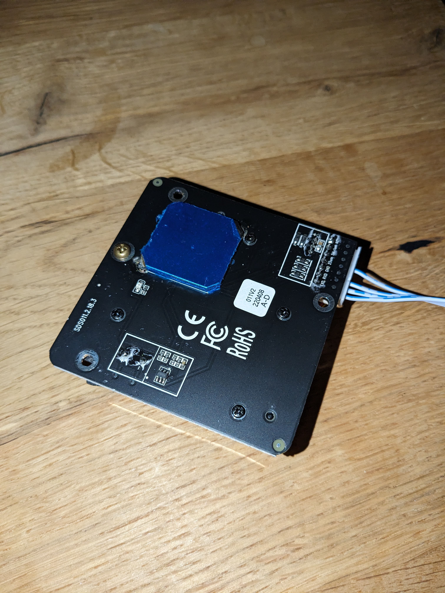
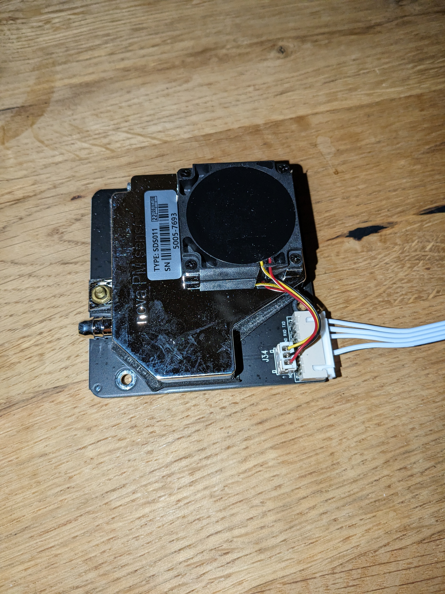
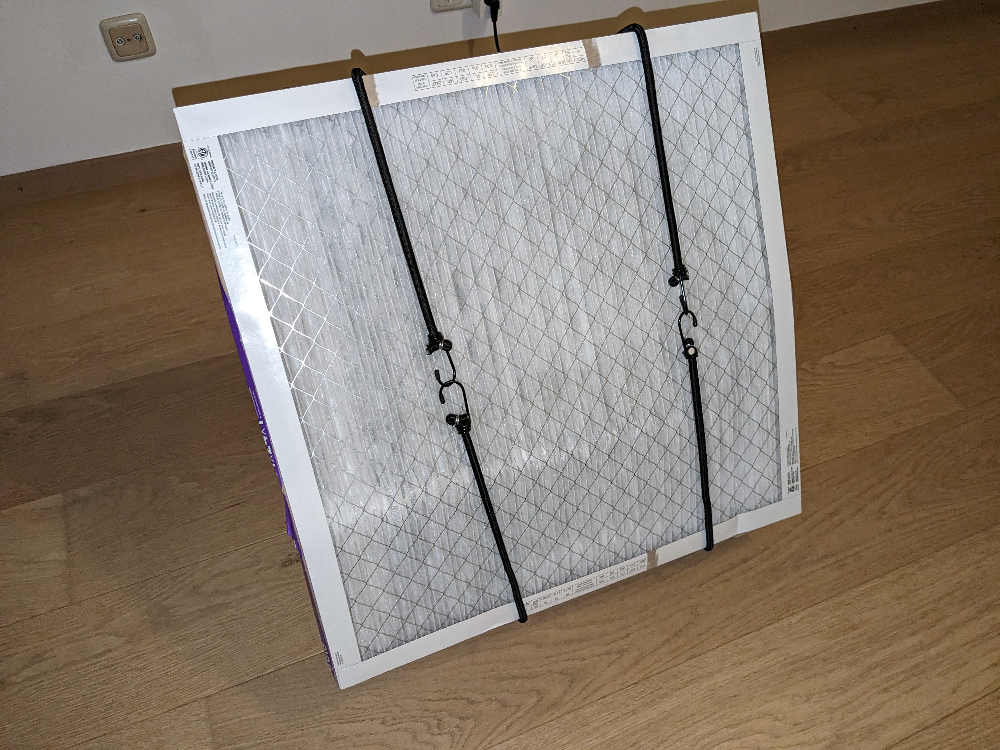
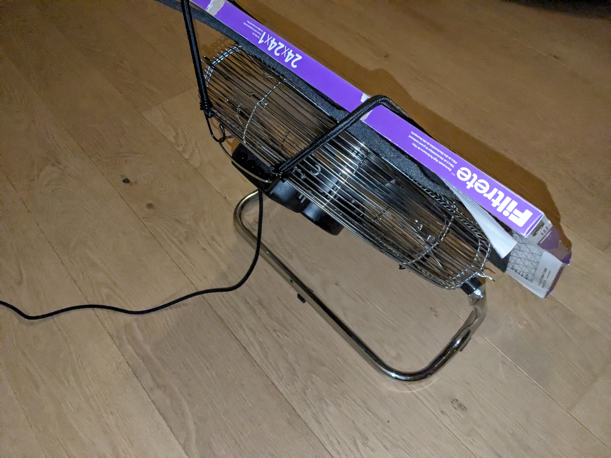
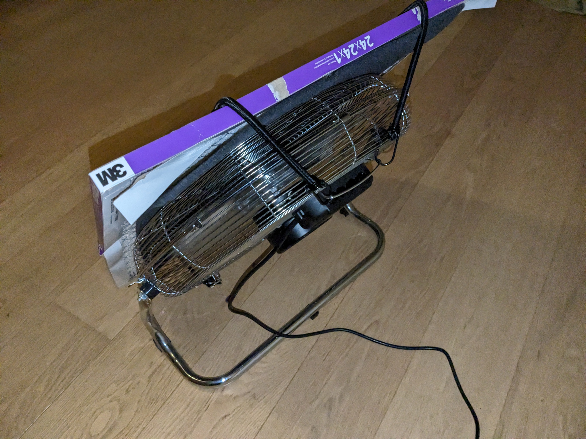

# Air

A Go application to read PM2.5 and PM10 readings from the SDS011 sensor.

This repository also explains how to setup your own air filter and which resources
you can follow to get cleaner air in your living area.

Features:

- Build a time-series database.
- Graph the data

## Requirements

You need `go 1.21+` and `libusb`.

For Arch you can install `libusb` with pacman.
This will work for arm systems as well (e.g. RaspberryPi).

```sh
pacman -Sy libusb
# or
yay -Sy libusb
```

To allow the user running this application
access to the device, you need to add a udev rule.
Learn more about udev rules [here](https://wiki.archlinux.org/title/Udev).

```sh
sudo vi /etc/udev/rules.d/10-pm-sensor.rules
```

```
SUBSYSTEMS=="usb", ATTRS{idVendor}=="1a86", ATTRS{idProduct}=="7523", MODE="0660", TAG+="uaccess"
```

Let udev reload the rules.

```sh
sudo udevadm control --reload
sudo udevadm trigger
```

## Installing

```sh
git clone github.com/Benehiko/air
cd air
go build -o air .
./air all --port 4444
```

Run the `--help` flag for the CLI help menu.

```sh
Usage:
   [command]

Available Commands:
  all         Starts the sensor and the web dashboard
  completion  Generate the autocompletion script for the specified shell
  help        Help about any command
  sensor      Starts the sensor
  web         Starts the web dashboard

Flags:
  -h, --help   help for this command

Use " [command] --help" for more information about a command.
```

I would recommend you first run the `./air sensor` command since it
will provide you with useful information regarding errors.

## Usage

```sh
./air all --port 4444
```

Navigate to https://localhost:4444

You should now see a dashboard.

If no `--port` flag is specified, the software will 
attempt to bind to a random free port.
The port will be printed in the logs.

---

You can also run only the sensor readings without the dashboard
with

```sh
./air sensor
```

## Documentation

I have included a copy of the SDS011 sensor manual
in this GitHub repository under `./docs/sds011-manual.pdf`.




Paired with this, I have DIY'd an air filter. It doesn't look very pleasant,
but it seems to do the job.





## Troubleshooting

The program won't connect to the sensor with code -3.

```sh
panic: Could not execute root command: Could not open a device: libusb: bad access [code -3]
```
Try updating your udev rules. Also ensure that the usb device
shows up on your system. 

You can check connected USB devices through `lsusb`.

```sh
pacman -Sy usbutils
# or
yay -Sy usbutils
```

```sh
lsusb
...
Bus 001 Device 003: ID 1a86:7523 QinHeng Electronics CH340 serial converter
```

---

A strange go error regarding `gousb` types being undefined etc.

Install `libusb` and reinstall the gousb package.


## Aknowledgements

While searching for ways to improve my indoor air quality, I stumbled upon
[smartairfilters by Thomas Talhelm](https://smartairfilters.com/en/blog/how-to-make-diy-air-purifier/).
This helped a lot with understanding the mysteries around air purification and
that it doesn't need to cost a lot!

As for air quality monitoring, I wanted something I could plug into a RaspberryPi
and just have run 24/7. I got some insightful information from [Jeff Geerling](https://www.jeffgeerling.com/blog/2021/airgradient-diy-air-quality-monitor-co2-pm25)
and [Alan Byrne](https://youtu.be/dxVUxYIrawU).

Ultimately I chose to get the SDS011 which is affordable and can be interacted
without the need for another propriatary App.
